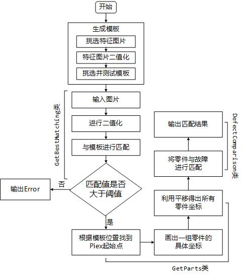

# PartsTemplateMatching
用于电路板的零件识别，所用方法为Opencv的模板识别
* Author : FreeA7
* Date : Jan 28, 2019
* Version : 1.0

## 注意
* code 由 [5300 零件匹配](https://github.com/FreeA7/5300)修改过来，所以现有所有函数都可直接用于 5300
* 使用之前一定要看此文档，可以帮助你快速入手
* testp 和 feature 中的图片都是 5300 的图片
* 最好使用类似 Photoshop 等软件进行描点，达到最好的匹配效率
* 请预先模仿 GetBestMatching 类中生成二值图片的方法生成好二值 feature ，参数都是我多次测试模拟效果最好的，一般不要改动，如果效果很差可自行调整。

## 算法总览

## 各文件描述
### init.py
* 这是执行文件，可在这里执行各种方法
* 方法包括对单独图片或者对整个文件夹的，注意注释即可使用
* 有的方法可以保存图片结果，注意注释即可
* 由于目前手头没有故障文件，所以用 nparray 进行测试替代
* 不同零件的阈值可能有较大区别，注意测试，如使用空图或者完全随机的图片

### utils.py
* 这是需要使用者自行修改的文件，包括零件位置，输出结构等
* 其中的函数不要修改，只是供 init 使用，绝大多数时候不用改
* 三个子类需要根据零件具体情况进行重写，具体请看注释

### getBestMatching.py
* 这是进行模板匹配并返回最佳匹配的父类
* 一般来说流程是固定的，不需要修改
* 需要调整的 resize 函数已经继承在 util.py 中，重写即可

### getParts.py
* 这是获取零件具体位置的父类
* 一般来说流程是固定的，不需要修改
* 需要调整的 getTarget 函数已经继承在 util.py 中，重写即可

### defectComparison.py
* 这是进行故障匹配并输出结果的父类
* 一般来说流程是固定的，不需要修改
* 需要调整的三个函数已经继承在 util.py 中，重写即可

### feature & testp & out
* 这是我在测试时使用的存放feature、图片和输出结果的文件夹
* 可删可改可随意调整，不固定，在 init 中写好位置就行
